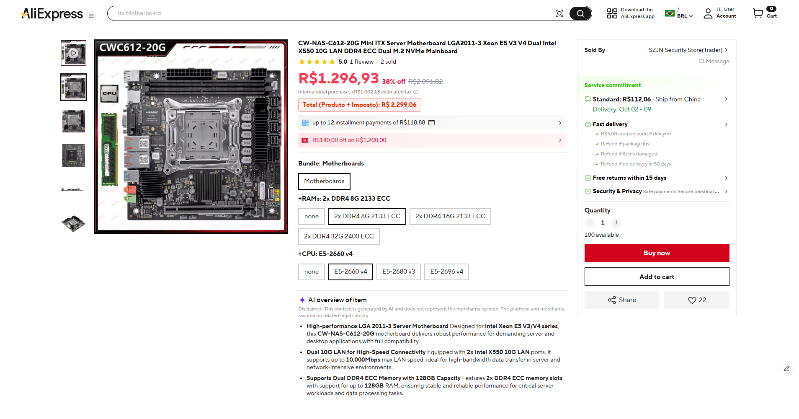
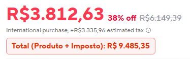

# AliExpress Total com Imposto

Extensão para o **Google Chrome** (Manifest V3) que mostra o **valor final** de um produto no AliExpress somando o preço do item ao imposto estimado.

---

## Por que existe?

Nas páginas de produto do AliExpress (especialmente compras internacionais para o Brasil), o site exibe:

1. O **preço do produto**
2. Separadamente, o **imposto estimado** (`estimated tax` / `imposto`)

O valor que você realmente paga é a **soma dos dois**, mas o AliExpress não destaca esse total de forma clara. É fácil olhar só o preço vermelho e esquecer o imposto logo abaixo.

Esta extensão resolve isso: calcula `produto + imposto` e injeta um aviso vermelho logo abaixo da linha de imposto.

### Exemplo

| Item | Valor |
|------|-------|
| Preço do produto | R$ 3.812,63 |
| Imposto estimado | R$ 3.335,96 |
| **Total real** | **R$ 7.148,59** |

---

## Como fica na página

### Página de produto no AliExpress

O preço e a linha de imposto estimado aparecem assim:



### Badge da extensão

A extensão adiciona um bloco destacado com o total somado:



> O total usa sempre o **preço atual** (o vermelho em destaque), **nunca** o preço riscado de “de / por”.

---

## Estrutura do projeto

```text
aliexpress-tax-total/
├── manifest.json   # Configuração da extensão (Manifest V3)
├── content.js      # Script injetado na página do produto
├── docs/           # Prints usados neste README
│   ├── pagina-produto.png
│   └── total-com-imposto.png
└── README.md
```

| Arquivo | Função |
|---------|--------|
| `manifest.json` | Define nome, versão e em quais URLs o script roda |
| `content.js` | Lê preço e imposto no DOM, soma e injeta o badge |
| `docs/` | Imagens de documentação |

---

## Como instalar no Chrome

1. Abra o Chrome e acesse:

   ```text
   chrome://extensions/
   ```

2. No canto superior direito, ative **Modo do desenvolvedor** (*Developer mode*).

3. Clique em **Carregar sem compactação** (*Load unpacked*).

4. Selecione a pasta:

   ```text
   aliexpress-tax-total
   ```

   (a pasta que contém o `manifest.json`)

5. Abra qualquer página de produto no AliExpress, por exemplo:

   ```text
   https://pt.aliexpress.com/item/...
   ```

6. Recarregue a página (`F5`). O badge **Total (Produto + Imposto)** deve aparecer abaixo da linha de imposto.

### Atualizar depois de mudar o código

1. Vá em `chrome://extensions/`
2. Clique em **Recarregar** na extensão
3. Dê `F5` na aba do AliExpress

---

## Como funciona

1. O `content.js` é injetado automaticamente em páginas que batem com:
   - `*://*.aliexpress.com/item/*`
   - `*://*.aliexpress.com/p/*`

2. O script procura no DOM a linha de imposto (`estimated tax` ou `imposto` + valor em `R$`).

3. Localiza o **preço vigente** do produto (ignora preço riscado / `line-through`).

4. Soma os dois valores e injeta o elemento `#ali-custom-tax-total`.

5. Um `MutationObserver` acompanha mudanças na página (troca de cor, kit, frete, variação). Como o AliExpress é uma SPA, o preço muda sem reload completo — o observer recalcula o total automaticamente.

```text
Preço atual  +  Imposto estimado  →  Badge "Total (Produto + Imposto)"
     ↓                  ↓
  R$ 3.812,63      R$ 3.335,96      →  R$ 7.148,59
```

---

## Requisitos

- Google Chrome (ou Chromium / Edge compatível com extensões MV3)
- Página de produto do AliExpress com preço em **BRL (R$)** e linha de imposto estimado visível

---

## Limitações

- Só funciona em páginas de **item/produto** (`/item/` ou `/p/`).
- Depende do texto de imposto estar visível na página (`estimated tax` / `imposto`).
- O frete **não** entra na soma (apenas produto + imposto estimado).
- Classes CSS do AliExpress mudam com frequência; a extensão busca por padrões de texto (`R$`, `estimated tax`), não por classes fixas.

---

## Licença

Uso pessoal / educacional. Não afiliada ao AliExpress.
