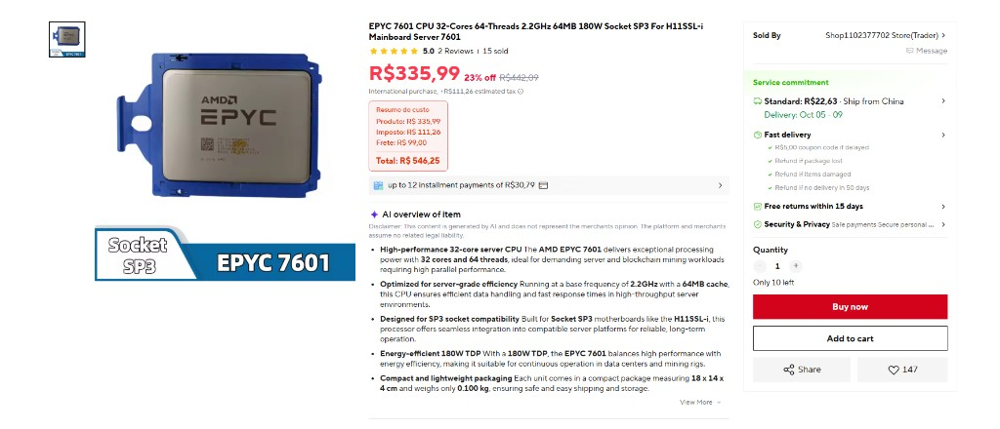
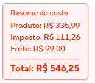

# AliExpress Total com Imposto

Extensão para o **Google Chrome** (Manifest V3) que mostra o **custo real** de um produto no AliExpress: **produto + imposto estimado + frete**, com o **Total** em destaque.

**Versão atual:** 1.3

---

## Por que existe?

Nas páginas de produto do AliExpress (compras internacionais para o Brasil), os custos aparecem espalhados:

1. **Preço do produto** (em destaque, vermelho)
2. **Imposto estimado** (`estimated tax` / `imposto`) logo abaixo
3. **Frete** em outro bloco (`Standard`, `Ship from`, etc.)

O valor que você realmente paga é a **soma dos três**, mas o site não deixa isso óbvio. É fácil olhar só o preço vermelho e esquecer imposto e frete.

Esta extensão lê esses valores e injeta um **Resumo do custo** com o **Total** logo abaixo da linha de imposto.

---

## Como fica na página

### Página de produto com a extensão ativa

O resumo aparece abaixo do imposto estimado:



### Detalhe do resumo



### Exemplo (valores da captura)

| Item | Valor |
|------|-------|
| Produto | R$ 335,99 |
| Imposto | R$ 111,26 |
| Frete | R$ 99,00 |
| **Total** | **R$ 546,25** |

```text
Resumo do custo
Produto: R$ 335,99
Imposto: R$ 111,26
Frete:   R$ 99,00
─────────────────
Total:   R$ 546,25
```

> O total usa sempre o **preço atual** (vermelho), **nunca** o preço riscado de “de / por”.  
> Se o frete for grátis, aparece `Frete: Grátis`. Se não for encontrado, aparece `Frete: —` e o total fica com produto + imposto.

---

## Estrutura do projeto

```text
plugin/
├── README.md
├── docs/
│   ├── pagina-com-resumo.png   # Captura da página com a extensão
│   └── resumo-custo.png        # Detalhe do badge
└── aliexpress-tax-total/
    ├── manifest.json           # Configuração (Manifest V3)
    ├── content.js              # Script injetado na página
    └── docs/                   # Cópias das imagens
```

| Arquivo | Função |
|---------|--------|
| `aliexpress-tax-total/manifest.json` | Nome, versão e URLs onde o script roda |
| `aliexpress-tax-total/content.js` | Lê preço, imposto e frete, soma e injeta o badge |
| `docs/` | Prints usados neste README |

---

## Como instalar no Chrome

1. Abra o Chrome e acesse:

   ```text
   chrome://extensions/
   ```

2. No canto superior direito, ative **Modo do desenvolvedor** (*Developer mode*).

3. Clique em **Carregar sem compactação** (*Load unpacked*).

4. Selecione a pasta:

   ```text
   aliexpress-tax-total
   ```

   (a pasta que contém o `manifest.json`)

5. Abra qualquer página de produto no AliExpress, por exemplo:

   ```text
   https://pt.aliexpress.com/item/...
   ```

6. Recarregue a página (`F5`). O **Resumo do custo** com o **Total** deve aparecer abaixo da linha de imposto.

### Atualizar depois de mudar o código

1. Vá em `chrome://extensions/`
2. Clique em **Recarregar** na extensão
3. Dê `F5` na aba do AliExpress

---

## Como funciona

1. O `content.js` é injetado em páginas que batem com:
   - `*://*.aliexpress.com/item/*`
   - `*://*.aliexpress.com/p/*`

2. Localiza a linha de imposto (`estimated tax` / `imposto` + `R$`).

3. Lê o **preço vigente** do produto (ignora preço riscado / `line-through`).

4. Lê o **frete** (textos como `Ship from`, `Standard`, `frete`, `envio`, ou frete grátis).

5. Soma tudo e injeta `#ali-custom-tax-total` com breakdown + **Total**.

6. Um `MutationObserver` acompanha mudanças na página (variação, kit, frete). Como o AliExpress é uma SPA, o total é recalculado sem precisar de reload completo.

```text
Produto   +   Imposto   +   Frete   →   Total
R$ 335,99 + R$ 111,26 + R$ 99,00 → R$ 546,25
```

---

## Requisitos

- Google Chrome (ou Chromium / Edge compatível com extensões MV3)
- Página de produto do AliExpress com preço em **BRL (R$)** e linha de imposto estimado visível

---

## Limitações

- Só funciona em páginas de **item/produto** (`/item/` ou `/p/`).
- Depende do texto de imposto estar visível (`estimated tax` / `imposto`).
- Se o frete não for encontrado no DOM, o total usa apenas produto + imposto (`Frete: —`).
- Classes CSS do AliExpress mudam com frequência; a extensão busca por padrões de texto (`R$`, `estimated tax`, `Ship from`), não por classes fixas.

---

## Licença

Uso pessoal / educacional. Não afiliada ao AliExpress.
